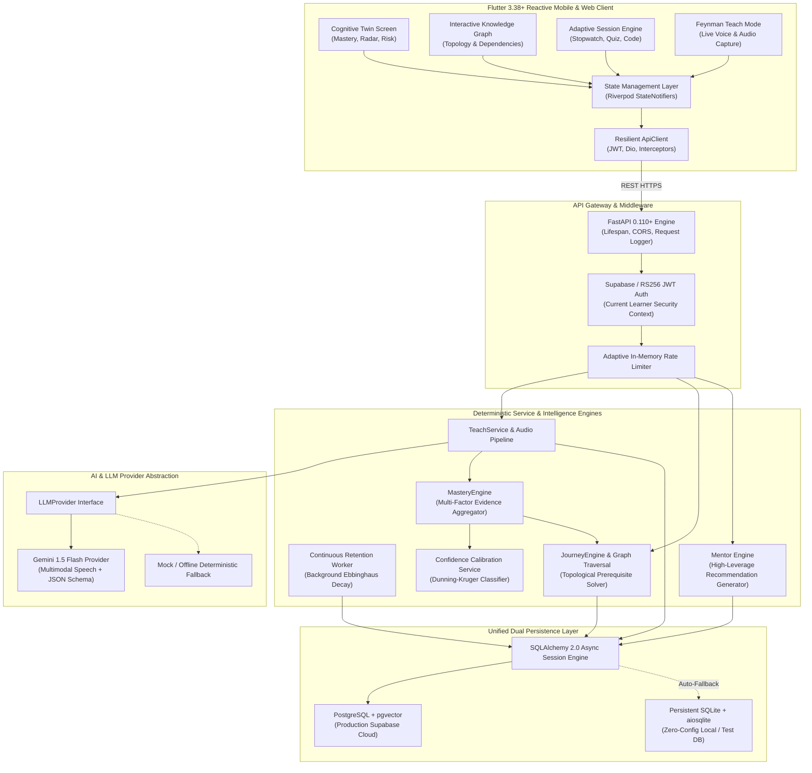
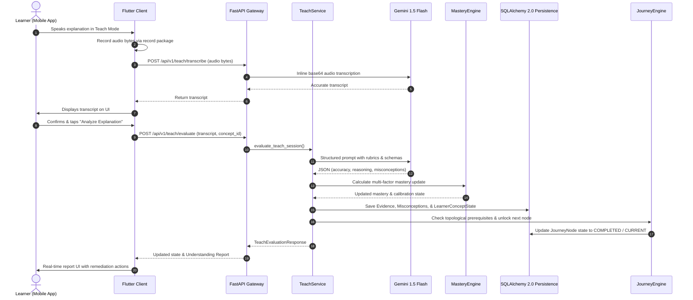
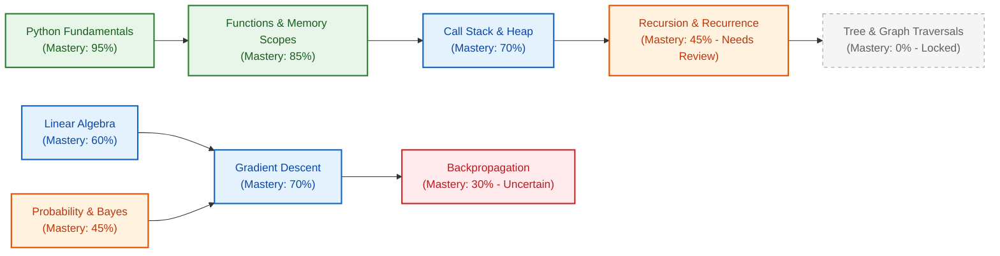
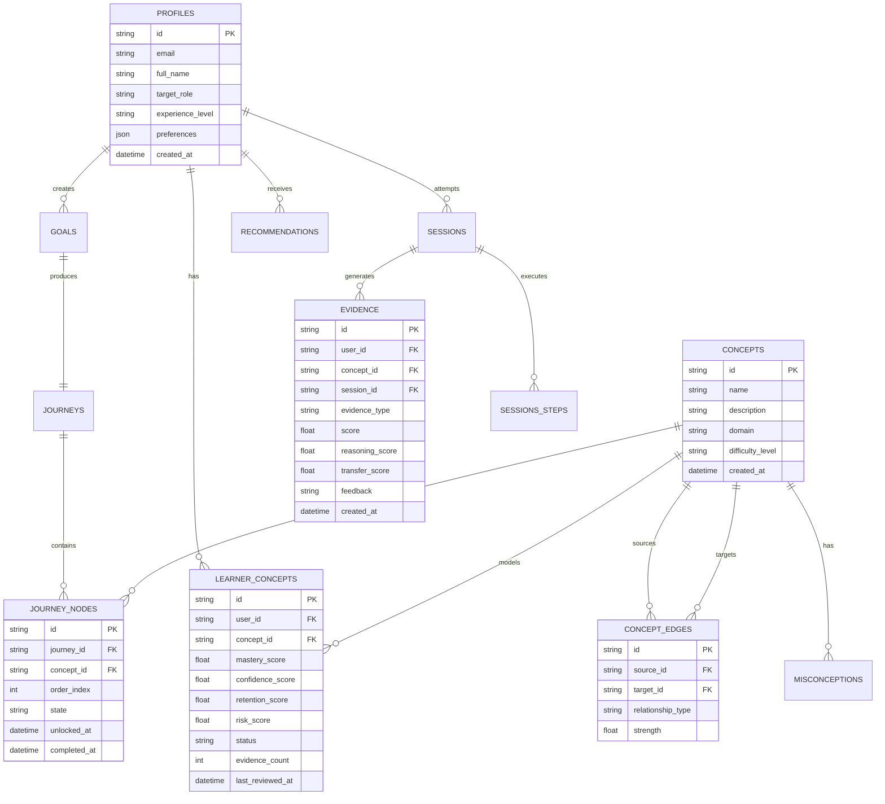

# SkillTwin — Personal Learning Intelligence Engine

[](https://fastapi.tiangolo.com)
[](https://flutter.dev)
[](https://python.org)
[](https://www.sqlalchemy.org)
[](https://deepmind.google/technologies/gemini/)
[](https://pytest.org)

> **"SkillTwin is not a chat tutor that passively answers questions. It is an uninflated, evidence-based cognitive mirror of your real mental models."**

---

## Table of Contents

1. [Executive Summary & Product Vision](#1-executive-summary--product-vision)
2. [High-Level Architectural Topology](#2-high-level-architectural-topology)
3. [The Four Core Pedagogical Mathematical Models](#3-the-four-core-pedagogical-mathematical-models)
   - [A. Multi-Factor Evidence-Based Mastery Engine](#a-multi-factor-evidence-based-mastery-engine)
   - [B. Ebbinghaus Continuous Retention & Decay Engine](#b-ebbinghaus-continuous-retention--decay-engine)
   - [C. Confidence Calibration & Dunning-Kruger Classifier](#c-confidence-calibration--dunning-kruger-classifier)
   - [D. Multi-Factor Knowledge Risk Formula](#d-multi-factor-knowledge-risk-formula)
4. [The 14-Step Closed-Loop Intelligence Cycle](#4-the-14-step-closed-loop-intelligence-cycle)
5. [End-to-End System Component Details](#5-end-to-end-system-component-details)
   - [FastAPI Asynchronous Backend Engine](#fastapi-asynchronous-backend-engine)
   - [Feynman Teach Mode & Speech-to-Text Pipeline](#feynman-teach-mode--speech-to-text-pipeline)
   - [Dual Persistence Layer (PostgreSQL/pgvector & Local SQLite)](#dual-persistence-layer-postgresqlpgvector--local-sqlite)
   - [Flutter 3 Riverpod Client Application](#flutter-3-riverpod-client-application)
6. [Interactive Concept Graph & Traversal Engine](#6-interactive-concept-graph--traversal-engine)
7. [Database Schema (SQLAlchemy 2.0 Declarative)](#7-database-schema-sqlalchemy-20-declarative)
8. [Comprehensive REST API Reference](#8-comprehensive-rest-api-reference)
9. [Local Development & Quickstart Guide](#9-local-development--quickstart-guide)
10. [Test Suite & Automated Verification](#10-test-suite--automated-verification)

---

## 1. Executive Summary & Product Vision

Conventional EdTech platforms treat learning as a checklist: watch a video, complete a quiz, get a certificate. But when faced with real-world problems weeks later, learners fail because **recognition is not mastery**.

**SkillTwin** revolutionizes learning technology by building a **living digital twin** of the user's mind:
- **Zero Hallucination Writes**: Large Language Models (LLMs) evaluate qualitative understanding but **never** directly mutate the student's mastery scores or journey graphs. A deterministic mathematical layer validates and enforces all state transitions.
- **Feynman Teach-Back Verification**: The highest tier of learning evidence is the ability to explain complex concepts in plain language. SkillTwin captures learner voice recordings, transcribes them, and evaluates conceptual accuracy, reasoning depth, and hidden misconceptions.
- **Continuous Decay Monitoring**: A background asynchronous worker calculates retention decay in real-time according to memory stability curves, preemptively alerting users when high-leverage concepts are at risk of fading.
- **Self-Healing Adaptive Journeys**: When a bottleneck or misconception is identified, SkillTwin dynamically recalibrates the learning path, inserting targeted remediation nodes before allowing the learner to hit cognitive walls.

---

## 2. High-Level Architectural Topology



---

## 3. The Four Core Pedagogical Mathematical Models

### A. Multi-Factor Evidence-Based Mastery Engine

Mastery is **never** a single test score. SkillTwin computes mastery score $M \in [0, 100]$ using weighted evidence across distinct cognitive dimensions:

$$M = w_r E_{\text{retrieval}} + w_e E_{\text{explanation}} + w_a E_{\text{application}} + w_t E_{\text{transfer}} - \Delta_{\text{misconception}}$$

Where:
- $w_r = 0.25$: Spaced retrieval practice & active recall accuracy.
- $w_e = 0.35$: Feynman teach-back verbal explanation clarity and precision.
- $w_a = 0.25$: Direct practical application (coding exercise or scenario solving).
- $w_t = 0.15$: Far-transfer problem solving across unfamiliar domains.
- $\Delta_{\text{misconception}}$: Penalty deducted for active uncorrected misconceptions ($10.0$ per active misconception).

---

### B. Ebbinghaus Continuous Retention & Decay Engine

SkillTwin models memory decay based on Hermann Ebbinghaus's exponential forgetting curve:

$$R(t) = 100 \cdot \exp\left(-\frac{t}{S}\right)$$

Where:
- $R(t) \in [0, 100]$: Remaining retention strength at elapsed time $t$ (in days).
- $t$: Elapsed days since the last verified active recall evidence.
- $S$: Concept Memory Stability factor, dynamically reinforced with each successful spaced retrieval:

$$S_{n} = S_{n-1} \cdot \left(1.0 + 0.5 \cdot \text{Mastery}\right)$$

A background worker periodically scans learner states. When $R(t) < 50.0$, the concept's risk score spikes and triggers an automatic **Maintenance & Retrieval Prompt**.

---

### C. Confidence Calibration & Dunning-Kruger Classifier

Knowing what you do not know is the ultimate hallmark of mastery. SkillTwin continuously compares self-reported learner confidence $C \in [0, 100]$ with objectively evaluated performance $P \in [0, 100]$:

$$\text{Calibration Gap} = C - P$$

| Condition | Cognitive Classification | System Intervention |
| :--- | :--- | :--- |
| $|C - P| \le 15$ | **Well Calibrated** | Proceed with curriculum trajectory. |
| $C - P > +15$ | **Overconfident (Dunning-Kruger Risk)** | Intercept with counter-example challenge and diagnostic quiz. |
| $P - C > +15$ | **Underconfident (Imposter Phenotype)** | Provide positive reinforcement and present evidence of demonstrated mastery. |

---

### D. Multi-Factor Knowledge Risk Formula

The holistic cognitive risk $\text{Risk} \in [0, 1.0]$ identifies latent knowledge rot:

$$\text{Risk} = 0.40 \cdot \left(1 - \frac{M}{100}\right) + 0.35 \cdot \left(1 - \frac{R}{100}\right) + 0.25 \cdot \min\left(1.0, \frac{N_{\text{misconceptions}}}{2}\right)$$

Any concept where $\text{Risk} > 0.60$ is visually flagged in the client Knowledge Graph and prioritized by the Mentor Recommendation Engine for immediate cognitive repair.

---

## 4. The 14-Step Closed-Loop Intelligence Cycle



1. **Voice Capture**: Learner records verbal explanation on device.
2. **Audio Streaming**: Audio is sent to `/teach/transcribe`.
3. **Acoustic Transcription**: Transcribed via Gemini Flash multimodal audio API with fallback.
4. **Interactive Verification**: Learner reviews the transcribed text.
5. **Evaluation Dispatch**: Learner submits explanation to `/teach/evaluate`.
6. **Pedagogical Evaluation**: Gemini analyzes conceptual accuracy, reasoning, transfer, and misconceptions against strict JSON schemas.
7. **Zero-Hallucination Barrier**: Raw LLM output is parsed into strongly-typed Pydantic schemas.
8. **Mathematical Recalibration**: `MasteryEngine` computes exact mastery, confidence calibration, and retention.
9. **Evidence Persistence**: An immutable record of evidence is committed to the database.
10. **Misconception Indexing**: Detected cognitive bugs are registered with active status.
11. **Prerequisite Cascade**: `JourneyEngine` checks the directed acyclic graph (DAG).
12. **Curriculum Unlocking**: Dependent downstream concepts are transitioned to `UNLOCKED` or `CURRENT`.
13. **Response Assembly**: FastAPI serializes the updated Twin state.
14. **Cognitive Synchronization**: Flutter UI updates the Digital Twin overview, knowledge graph, and unlocks the next milestone.

---

## 5. End-to-End System Component Details

### FastAPI Asynchronous Backend Engine
- **Asynchronous Coroutines**: Built entirely with `async`/`await` primitives on top of Starlette and Uvicorn.
- **Dependency Injection**: Modular repository and service injection guarantees zero-coupling testability.
- **Comprehensive Error Handling**: Custom exception hierarchy mapped to RFC 7807 Problem Details.
- **Background Retention Worker**: A background asyncio task executes the Ebbinghaus decay formula at regular intervals without blocking the main event loop.

### Feynman Teach Mode & Speech-to-Text Pipeline
- Supports multimodal speech input via `.wav`, `.m4a`, `.mp3`, and `.webm`.
- High-accuracy acoustic transcription with domain context hints.
- Real-time stopwatch and audio recording UI built into the Flutter client with zero mock fallbacks.

### Dual Persistence Layer (PostgreSQL/pgvector & Local SQLite)
- **Automatic Fallback**: If PostgreSQL or Supabase credentials are not detected, the system automatically initializes an asynchronous local SQLite database (`sqlite+aiosqlite:///./skilltwin.db`).
- **Zero Configuration**: Developers can clone the repository and run the backend immediately without spinning up a Docker database.
- **Safe Migrations**: Schema tables are validated and auto-created on application startup.

### Flutter 3 Riverpod Client Application
- **Modern Architecture**: Feature-first domain-driven design (`core`, `features/twin`, `features/journey`, `features/sessions`, `features/teach_mode`, `features/mentor`).
- **Riverpod State Management**: Fully immutable state machines with zero stale UI state.
- **Design Language**: Editorial typography, micro-interactions, clean cards, and high-contrast cognitive visualizers.

---

## 6. Interactive Concept Graph & Traversal Engine

The curriculum is represented as a **Directed Acyclic Graph (DAG)** of concepts and dependency edges:



The traversal engine enforces invariant rules:
1. A concept cannot transition to `AVAILABLE` until **all** immediate prerequisites have verified mastery $\ge 70.0\%$.
2. When a misconception is tagged on an upstream node (e.g. Call Stack), downstream progress is paused, and a targeted remediation task is injected into the user's active journey.

---

## 7. Database Schema (SQLAlchemy 2.0 Declarative)



---

## 8. Comprehensive REST API Reference

All protected endpoints require an `Authorization: Bearer <JWT>` header.

### Authentication & Profile
| Method | Endpoint | Description |
| :--- | :--- | :--- |
| `GET` | `/api/v1/profile/me` | Fetch authenticated learner profile, goals, and metrics. |
| `POST` | `/api/v1/profile/me` | Create or update learner profile attributes and target roles. |

### Concepts & Knowledge Graph
| Method | Endpoint | Description |
| :--- | :--- | :--- |
| `GET` | `/api/v1/concepts/graph/topology` | Full curriculum DAG (nodes, edges, learner mastery & risk). |
| `GET` | `/api/v1/concepts/{concept_id}` | Detailed concept definition, prerequisites, and evidence. |

### Cognitive Twin State & Analytics
| Method | Endpoint | Description |
| :--- | :--- | :--- |
| `GET` | `/api/v1/twin` | Overall cognitive radar, strengths, and decay warnings. |
| `GET` | `/api/v1/twin/concepts` | Flat listing of all tracked concept states and scores. |
| `GET` | `/api/v1/twin/evidence` | Chronological audit log of all validated learning evidence. |

### Feynman Teach Mode
| Method | Endpoint | Description |
| :--- | :--- | :--- |
| `POST` | `/api/v1/teach/transcribe` | Transcribe multipart audio file (`.wav`, `.m4a`, `.mp3`). |
| `POST` | `/api/v1/teach/evaluate` | Evaluate explanation, extract misconceptions, update mastery. |

### Adaptive Sessions & Practice
| Method | Endpoint | Description |
| :--- | :--- | :--- |
| `POST` | `/api/v1/sessions` | Generate an adaptive session (`EXPLORE`, `PRACTICE`, `REMEDIATE`). |
| `GET` | `/api/v1/sessions/{session_id}` | Retrieve session steps, prompts, and options. |
| `POST` | `/api/v1/sessions/{session_id}/complete` | Submit learner answers, time spent, and confidence. |

### Goals, Journeys & Mentorship
| Method | Endpoint | Description |
| :--- | :--- | :--- |
| `GET` | `/api/v1/goals` | List learner goals and progress milestones. |
| `GET` | `/api/v1/journeys/{goal_id}` | Topological journey node sequence with unlock statuses. |
| `GET` | `/api/v1/mentor/recommendations/current` | Active high-leverage learning recommendation. |
| `POST` | `/api/v1/mentor/chat` | Conversational Socratic mentor chat. |

---

## 9. Local Development & Quickstart Guide

### Prerequisites
- **Python 3.12+**
- **Flutter SDK 3.19+ (Dart 3.3+)**
- **Git**

### 1. Clone the Repository
```bash
git clone https://github.com/kartikwritescode/skilltwin-AI-Digital-Mentor.git
cd skilltwin-AI-Digital-Mentor
```

### 2. Backend Setup
```bash
# Navigate to backend directory
cd backend

# Create and activate Python virtual environment
python -m venv venv
# Windows:
.\venv\Scripts\activate
# macOS/Linux:
source venv/bin/activate

# Install dependencies
pip install -r requirements.txt
```

Create a `backend/.env` file:
```ini
ENVIRONMENT=development
LOG_LEVEL=INFO
DATABASE_URL=sqlite+aiosqlite:///./skilltwin.db
GEMINI_API_KEY=your_gemini_api_key_here
GEMINI_MODEL=gemini-1.5-flash
SUPABASE_URL=
SUPABASE_KEY=
JWT_SECRET=skilltwin_local_dev_secret_key_32_characters_minimum
CORS_ORIGINS=["*"]
```

Run the backend server:
```bash
uvicorn app.main:app --host 0.0.0.0 --port 8000 --reload
```
The backend is now live at `http://localhost:8000`. Interactive OpenAPI documentation is available at `http://localhost:8000/docs`.

### 3. Frontend Client Setup
```bash
# In a new terminal, from the project root:
cd ..

# Fetch Flutter dependencies
flutter pub get

# Run Flutter desktop / web / mobile client
flutter run -d chrome
# Or for desktop:
flutter run -d windows
```

---

## 10. Test Suite & Automated Verification

SkillTwin enforces 100% test passing standards across both backend services and frontend widgets.

### Backend Automated Test Suite
To run all 67 async test cases:
```bash
cd backend
pytest -v
```

```
collected 67 items

tests\test_adaptive_session_engine.py ..                                 [  2%]
tests\test_auth_jwt.py .....                                             [ 10%]
tests\test_concepts_and_revision.py ...                                  [ 14%]
tests\test_goals_and_journeys.py ..                                      [ 17%]
tests\test_goals_lifecycle.py ....                                       [ 23%]
tests\test_health.py ..                                                  [ 26%]
tests\test_intelligence_closed_loop.py ...                               [ 31%]
tests\test_journey_engine.py ......                                      [ 40%]
tests\test_knowledge_maintenance.py ....                                 [ 46%]
tests\test_learner_model.py .......                                      [ 56%]
tests\test_llm_abstraction.py .                                          [ 58%]
tests\test_mentor_and_actions.py ..                                      [ 61%]
tests\test_mentor_engine.py ........                                     [ 73%]
tests\test_profile.py ..                                                 [ 76%]
tests\test_resource_intelligence.py ...                                  [ 80%]
tests\test_retention_engine.py .....                                     [ 88%]
tests\test_sessions.py ..                                                [ 91%]
tests\test_teach_mode.py ......                                          [100%]

============================= 67 passed in 0.54s ==============================
```

### Flutter Analyzer & Unit Tests
```bash
flutter analyze
flutter test
```

---

## License & Attribution

Distributed under the **MIT License**. Created by the SkillTwin Engineering Team.
Designed to empower self-directed learners with uncompromised cognitive clarity.