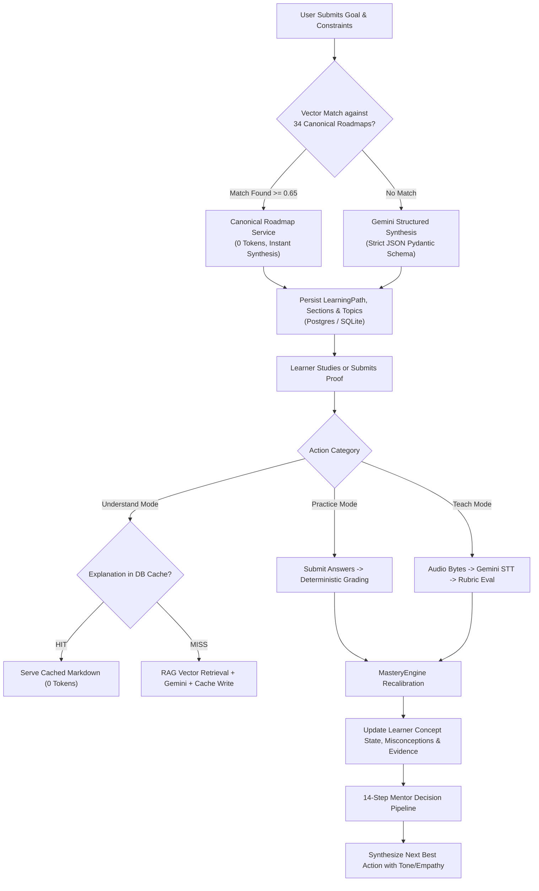
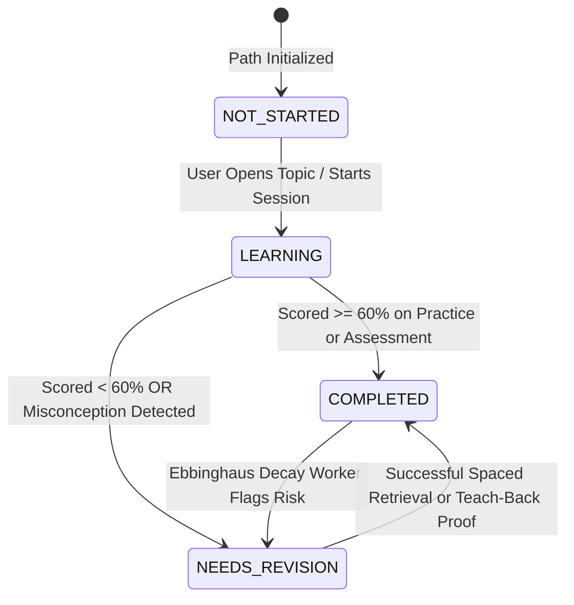

# SkillTwin Architecture & Intelligence Engine Deep Dive
**Comprehensive Technical Specification, Execution Pipeline, AI Mechanics, Cost Model & Production Engineering Guide**

---

## Table of Contents
1. [Executive Overview & Mental Model](#1-executive-overview--mental-model)
2. [Sequential High-Level Walkthrough (Basic to Advanced)](#2-sequential-high-level-walkthrough-basic-to-advanced)
   - [Level 1: The User Journey & Frontend Experience](#level-1-the-user-journey--frontend-experience)
   - [Level 2: The API & Service Orchestration Layer](#level-2-the-api--service-orchestration-layer)
   - [Level 3: The Persistence & Dual-Database Layer](#level-3-the-persistence--dual-database-layer)
   - [Level 4: The Deterministic Mathematical Intelligence Engines](#level-4-the-deterministic-mathematical-intelligence-engines)
   - [Level 5: The AI & Multimodal LLM Reasoning Layer](#level-5-the-ai--multimodal-llm-reasoning-layer)
3. [Working Structure of the SkillTwin Engine](#3-working-structure-of-the-skilltwin-engine)
   - [A. Goal Onboarding & Curriculum Synthesis Engine](#a-goal-onboarding--curriculum-synthesis-engine)
   - [B. Canonical Roadmap Fast-Tracking Engine (0-Token Curricula)](#b-canonical-roadmap-fast-tracking-engine-0-token-curricula)
   - [C. The 14-Step Mentor Decision Pipeline](#c-the-14-step-mentor-decision-pipeline)
   - [D. Multi-Factor Evidence-Based Mastery Engine](#d-multi-factor-evidence-based-mastery-engine)
   - [E. Continuous Memory Retention & Spaced Retrieval Engine](#e-continuous-memory-retention--spaced-retrieval-engine)
   - [F. Feynman Teach Mode & Speech-to-Text Multimodal Pipeline](#f-feynman-teach-mode--speech-to-text-multimodal-pipeline)
   - [G. RAG Grounding & Token-Throttled Context Builder](#g-rag-grounding--token-throttled-context-builder)
4. [Behind the Scenes: Where & How Responses Are Generated](#4-behind-the-scenes-where--how-responses-are-generated)
   - [The 3-Tier Fallback Hierarchy](#the-3-tier-fallback-hierarchy)
   - [Structured JSON Schema Enforcement](#structured-json-schema-enforcement)
   - [Database-Level Prompt & Output Caching](#database-level-prompt--output-caching)
   - [Offline Pedagogical Fallback Engine](#offline-pedagogical-fallback-engine)
5. [Complete State Machine & Edge Cases Handled](#5-complete-state-machine--edge-cases-handled)
   - [Journey & Topic State Machine](#journey--topic-state-machine)
   - [Learner Concept States & Transitions](#learner-concept-states--transitions)
   - [Critical Edge Cases & Handling Mechanisms](#critical-edge-cases--handling-mechanisms)
6. [LLM Cost & Deployment Financial Analysis](#6-llm-cost--deployment-financial-analysis)
   - [Per-Action Token Budget & Cost Breakdown](#per-action-token-budget--cost-breakdown)
   - [Monthly Cost Model at Scale (100 to 10,000 DAU)](#monthly-cost-model-at-scale-100-to-10000-dau)
   - [Infrastructure & Hosting Cost Breakdown](#infrastructure--hosting-cost-breakdown)
7. [Architectural Limitations & Scope of Improvement](#7-architectural-limitations--scope-of-improvement)
   - [Immediate Hardening Opportunities](#immediate-hardening-opportunities)
   - [Mid-Term Scalability Enhancements](#mid-term-scalability-enhancements)
   - [Long-Term Strategic Innovations](#long-term-strategic-innovations)

---

## 1. Executive Overview & Mental Model

### What SkillTwin Truly Is
Conventional learning applications are **content repositories with quizzes**: they serve static videos, track completion percentages, and assume that completing a video implies mastery. Chatbot tutors, on the other hand, are **stateless and reactive**: they answer questions in isolation without retaining an evolving mental model of the student.

**SkillTwin operates on a completely different paradigm:**
```
                     +------------------------------------------------+
                     |                 THE NORTH STAR                 |
                     | Tell SkillTwin where you want to go.           |
                     | Your mentor figures out what you do next.     |
                     +------------------------------------------------+
```

1. **Evidence Over Completion**: You do not progress through a roadmap by clicking "next". You progress by producing verifiable evidence (quizzes, code snippets, project submissions, verbal Feynman explanations, or spaced recall tests).
2. **Deterministic State vs. Generative Empathy**: 
   - **The LLM is NOT the database.** The LLM never directly modifies mastery scores, never updates journey states, and never determines which topic unlocks next.
   - **Mathematical engines calculate the state transitions.** The LLM is used strictly as a **reasoning and translation layer** for qualitative rubric evaluation and empathetic communication.
3. **The Living Learner Twin**: The backend maintains a high-fidelity digital twin of the learner (`LearnerConceptModel`, `LearnerTopicProgressModel`, `MisconceptionModel`, `ReviewItemModel`) that reflects:
   - What you know with confidence
   - What you know superficially (the Dunning-Kruger trap)
   - What you knew last week but are currently forgetting (Ebbinghaus memory decay)
   - What misconceptions are blocking you from unlocking subsequent topics

---

## 2. Sequential High-Level Walkthrough (Basic to Advanced)

To understand SkillTwin, follow the progression of information through its 5 systemic layers:

```
[Flutter Riverpod Client]  <-- HTTPS / REST (Dio + JWT) -->  [FastAPI Asynchronous Gateway]
            |                                                               |
            v                                                               v
  [Interactive UI & Graph]                                      [14-Step Decision Pipeline]
  [Voice Audio Capture]                                         [Deterministic Mastery Engine]
  [Local SharedPreferences]                                     [Ebbinghaus Decay Worker]
                                                                            |
                                                                            v
                                                       [Dual Persistence: Postgres / SQLite]
                                                                            |
                                                                            v
                                                       [Multimodal AI: Gemini / Mock]
```

### Level 1: The User Journey & Frontend Experience
- **Entry & Authentication (`lib/features/auth`)**:
  - The learner enters via email/password or guest mode.
  - The client talks to the backend `/api/v1/auth/signup` or `/login`.
  - Authentication returns a JWT token stored locally via `flutter_secure_storage` or `SharedPreferences`.
  - An interceptor in `lib/core/networking/api_client.dart` automatically injects `Authorization: Bearer <token>` into all subsequent HTTP requests.
- **Onboarding Flow (`lib/features/onboarding`)**:
  - The learner inputs: **Goal** (e.g. "Full-Stack Web Development"), **Target Level** ("Intermediate"), **Daily Commitment** (30 mins), and **Target Deadline** (e.g. 60 days).
  - The UI dispatches this to `/api/v1/learning-paths/goals`.
- **The Signature Winding Roadmap (`lib/features/journey`)**:
  - Rather than a plain list, the UI renders an adaptive winding path using custom Canvas painting.
  - Each milestone node represents a topic with discrete states: `LOCKED`, `AVAILABLE`, `CURRENT`, `COMPLETED`, `NEEDS_REVISION`.
- **Today's Action & Mentor Screen (`lib/features/mentor`)**:
  - When the user opens the app, the home screen does not ask "what do you want to learn?". It presents the **Single Next Best Action** computed by the backend decision engine.
- **Active Study Sessions & Teach Mode (`lib/features/sessions`, `lib/features/teach_mode`)**:
  - Topic study with 3 modes: **Understand** (RAG-grounded conceptual deep dive), **Practice** (MCQs, debugging, scenarios), and **Teach** (record verbal explanation via microphone using Feynman technique).

### Level 2: The API & Service Orchestration Layer
- Built with **FastAPI 0.110+** running on Python 3.12 (`uvicorn`).
- Mounted at `/api/v1` with 17 domain-specific modular routers (`auth`, `goals`, `learning_paths`, `topics`, `sessions`, `teach`, `revision`, `twin`, `voice`, etc.).
- **Lifespan Management (`backend/app/main.py`)**:
  - On startup: Runs dynamic database schema migrations, initializes connection pools, loads canonical roadmap fixtures, and spawns the background retention decay worker.
  - On shutdown: Flushes connections and cancels background tasks gracefully.
- **Dependency Injection**:
  - Every endpoint uses FastAPI dependencies (`Depends(get_current_user)`, `Depends(get_session)`) ensuring thread safety and request-scoped database sessions.

### Level 3: The Persistence & Dual-Database Layer
- **SQLAlchemy 2.0 Async Engine (`backend/app/core/database.py`)**:
  - Fully asynchronous with zero thread-blocking I/O.
- **Dual Compatibility**:
  - **Production (Supabase)**: Connects to PostgreSQL using `postgresql+asyncpg://` with connection pooling, pgvector extension for embeddings, and Supabase Auth JWT verification.
  - **Local/Offline (SQLite)**: If Supabase connection fails or credentials are placeholder, it automatically falls back to `sqlite+aiosqlite:///./skilltwin.db`.
- **Dynamic On-Boot Migration (`init_db`)**:
  - Inspects existing tables, executes safe `ALTER TABLE ADD COLUMN IF NOT EXISTS` statements for schema extensions, and invokes `Base.metadata.create_all` without dropping user data.

### Level 4: The Deterministic Mathematical Intelligence Engines
- Located in `backend/app/services/`:
  - `mastery_engine.py`: Weighted Bayesian-inspired evidence aggregation.
  - `retention_engine.py`: Ebbinghaus half-life memory decay curves.
  - `mentor_decision_pipeline.py`: 14-step ranking algorithm across 8 candidate actions.
  - `canonical_roadmap_service.py`: Vector cosine similarity matching against 34 pre-compiled industry curricula.
- **All business logic is deterministic, reproducible, and verifiable with unit tests.**

### Level 5: The AI & Multimodal LLM Reasoning Layer
- **Provider Abstraction (`backend/app/ai/providers/`)**:
  - An abstract base class `LLMProvider` defines contracts: `generate_text`, `generate_structured`, `embed`, and `evaluate`.
  - Concrete implementation: `GeminiLLMProvider` interfacing directly with Google Gemini REST API (`gemini-3.1-flash-lite`, `gemini-1.5-flash`, `text-embedding-004`).
  - Fallback implementation: `MockLLMProvider` offering full offline functionality with zero external API calls.

---

## 3. Working Structure of the SkillTwin Engine



### A. Goal Onboarding & Curriculum Synthesis Engine
When a user registers a goal:
1. `LearningPathService.create_goal_and_generate_path()` receives `LearningGoalCreateRequest`.
2. Computes **deadline pacing**: calculates `days_until_deadline` and `total_capacity_hours = (days * daily_minutes) / 60`.
3. First delegates to the **Canonical Roadmap Matcher** (see Section B).
4. If no canonical roadmap matches, formats `USER_PROMPT_TEMPLATE` from `app.ai.prompts.v1.learning_path`.
5. Calls `gemini.generate_structured()` requesting strict Pydantic model `GeneratedHierarchicalPath`.
6. Transacts to database:
   - 1 `LearningPathModel`
   - N `LearningSectionModel` (modules)
   - M `LearningTopicModel` (milestones with difficulty, duration, prerequisites, key concepts)
   - M `LearnerTopicProgressModel` (first topic set to `learning`, subsequent set to `not_started`).

### B. Canonical Roadmap Fast-Tracking Engine (0-Token Curricula)
SkillTwin bundles **34 pre-compiled, industry-verified technology roadmaps** (`backend/app/fixtures/roadmaps/*.json`):
- Full-Stack Web, Flutter Mobile, Android, iOS, Backend, Python Backend
- AI Engineer, Machine Learning, Data Scientist, MLOps, Data Engineer, BI Analyst
- DevOps, DevSecOps, Cyber Security, Cloud System Design, Network Engineer
- DSA Problem Solving, PostgreSQL, Software Architect, Product Management, QA, etc.

**Matching Mechanics (`canonical_roadmap_service.py`)**:
1. At boot, fixtures are loaded into memory and embedded into vectors using `text-embedding-004`.
2. When a goal arrives (e.g. "I want to be an expert in Flutter app development"), the query is embedded.
3. Cosine similarity is computed against all 34 canonical roadmaps.
4. If similarity $\ge 0.65$:
   - The roadmap is selected instantly.
   - Topics are dynamically pruned and tailored based on `target_level` and `available_time_mins`.
   - **Cost: 0 LLM generation tokens consumed. Latency: < 40ms.**

### C. The 14-Step Mentor Decision Pipeline
Located in `app/services/mentor_decision_pipeline.py`. Runs whenever the learner requests today's recommendation or finishes a session:

```
[Step 1: Load Goal] 
       ↓
[Step 2: Load Active Journey Node]
       ↓
[Step 3: Load Learner State (Mastery, Confidence, Evidence Count)]
       ↓
[Step 4: Load Recent Proofs of Work]
       ↓
[Step 5: Load Active Cognitive Misconceptions]
       ↓
[Step 6: Calculate Ebbinghaus Retention Decay]
       ↓
[Step 7: Verify Prerequisite Invariants]
       ↓
[Step 8: Evaluate Target Deadline Pressure]
       ↓
[Step 9: Score All 8 Candidate Actions]
       ↓
[Step 10: Rank Actions by Pedagogical Suitability]
       ↓
[Step 11: Select Single Next Best Action]
       ↓
[Step 12: LLM Empathy Synthesis (Grounding in Context Dossier)]
       ↓
[Step 13: Persist Recommendation to Database]
       ↓
[Step 14: Return Structured Payload to Client]
```

#### Deterministic Scoring Matrix:
| Action Type | Condition Trigger | Score Assigned | Pedagogical Rationale |
| :--- | :--- | :---: | :--- |
| **REMEDIATE** | Unmet prerequisite (<60%) or active misconceptions | **98.0 / 95.0** | Cognitive debt prevents forward progress. Must patch foundations first. |
| **REVISE** | Overdue scheduled spaced retrieval or memory decay risk | **92.0 / 72.0** | Ebbinghaus curve shows imminent forgetting. Review now before memory drops. |
| **PROVE** | High mastery ($\ge 75\%$) with insufficient proof ($< 2$ proofs) | **88.0** | Learner claims knowledge but lacks objective evidence. |
| **TEACH** | Solid mastery ($\ge 75\%$) with $\ge 2$ proofs | **86.0** | Feynman technique to test deep conceptual understanding and transfer. |
| **SKIP** | Mastery $\ge 90\%$, Confidence $\ge 85\%$, Evidence $\ge 2$ | **85.0 - 95.0** | Learner has proven advanced competence; skip redundant beginner topics. |
| **PRACTICE** | Moderate mastery ($40\% \le \text{Mastery} < 75\%$) | **82.0** | Concept introduced; learner needs active problem solving to solidify. |
| **LEARN** | Low mastery ($< 40\%$) on current node | **80.0** | Brand new milestone node; proceed with conceptual acquisition. |
| **REFLECT** | High deadline pressure with pending path review | **60.0** | Pacing adjustment and cognitive self-assessment required. |

### D. Multi-Factor Evidence-Based Mastery Engine
Located in `app/services/mastery_engine.py`. When evidence is submitted, mastery is updated mathematically:

#### 1. Evidence Type Cognitive Weighting
Different types of work represent different cognitive depths:
$$\text{Weight}(\text{Recall}) = 0.8 \quad|\quad \text{Weight}(\text{Assessment}) = 1.0 \quad|\quad \text{Weight}(\text{Practice}) = 1.2$$
$$\text{Weight}(\text{Explanation}) = 1.3 \quad|\quad \text{Weight}(\text{TeachBack}) = 1.4 \quad|\quad \text{Weight}(\text{Project}) = 1.5$$

#### 2. Composite Target Performance
$$\text{Target} = \min\Big(100.0, \, (\text{RawScore} \times \text{Weight} \times 0.85) + \text{Bonus}_{\text{consistency}} + \text{Bonus}_{\text{transfer}} + \text{Bonus}_{\text{explanation}}\Big)$$
- Consistency Bonus ($+5.0$): Granted if last 4 proofs all scored $\ge 70\%$.
- Application Bonus ($+4.0$): Granted if learner demonstrated code or project proof.
- Explanation Bonus ($+4.0$): Granted if verbal/written explanation was verified sound.

#### 3. Evidence Momentum Accumulation
As evidence accumulates, mastery becomes more stable and less prone to wild swings:
$$\text{Momentum } (m) = \min(0.75, \, 0.30 + 0.08 \times \text{EvidenceCount})$$
$$\text{NewMastery} = (\text{OldMastery} \times (1.0 - m)) + (\text{Target} \times m)$$

#### 4. Confidence Calibration & Dunning-Kruger Detection
Confidence is tracked independently from correctness to detect miscalibration:
$$\text{CalibratedConfidence} = (\text{SelfReported} \times 0.6) + (\text{ObjectiveScore} \times 0.4)$$
- **Dunning-Kruger Flag**: If Confidence $> 80\%$ but Objective Score $< 50\%$.
- **Imposter Syndrome Flag**: If Confidence $< 40\%$ but Objective Score $> 85\%$.

### E. Continuous Memory Retention & Spaced Retrieval Engine
Located in `app/services/retention_engine.py` and `app/workers/retention_worker.py`:

#### 1. Ebbinghaus Exponential Memory Decay
$$R(t) = 100 \times e^{-k \cdot t}$$
Where $t$ is the elapsed time in days since last retrieval, and $k$ is the decay constant modulated by accumulated repetitions:
$$k = \frac{0.25}{1.0 + 0.5 \times \text{EvidenceCount}}$$
As the learner practices a concept repeatedly, $k$ shrinks, flattening the forgetting curve.

#### 2. Spaced Interval Schedule Expansion
$$\text{Interval Progression: } [1 \text{ day} \to 3 \text{ days} \to 7 \text{ days} \to 14 \text{ days} \to 30 \text{ days} \to 60 \text{ days} \to 120 \text{ days}]$$
- **On Retrieval Success**: Advances to the next interval (or multiplies by $1.8\times$).
- **On Retrieval Failure**: Resets interval back to 1 day for immediate reinforcement.

#### 3. Composite Knowledge Risk Formula
$$\text{Risk} = (100 - R) \times 0.45 + (100 - M) \times 0.35 + \min(20, \, \text{Misconceptions} \times 10)$$
Where $R$ is Retention Score and $M$ is Mastery Score.
If $\text{Risk} \ge 65.0$, a priority revision alert is created.

### F. Feynman Teach Mode & Speech-to-Text Multimodal Pipeline
The ultimate test of understanding is teaching a concept simply:
1. Learner taps "Teach" on a topic, selects concept (e.g. "Event Loop in Node.js"), and records voice audio.
2. Flutter sends binary audio file (WAV/MP3/M4A) to `/api/v1/voice/transcribe` or `/api/v1/teach/evaluate`.
3. `GeminiSpeechToTextProvider` passes base64 audio directly to multimodal Gemini API with zero third-party transcription software needed.
4. `EvaluationService` grades the transcription against a 4-dimensional rubric:
   - **Conceptual Accuracy (35%)**: Are technical statements correct?
   - **Reasoning Depth (25%)**: Does the student explain *why*, or just recite definitions?
   - **Completeness (20%)**: Were essential invariants covered?
   - **Transfer & Analogies (20%)**: Did the student use analogies or real-world examples?
5. If score $\ge 80\%$ and no misconceptions are detected, historical misconception tags on that topic are automatically resolved!

### G. RAG Grounding & Token-Throttled Context Builder
Located in `app/ai/orchestrator/context_builder.py`.
- **The Problem**: Sending full conversation history and entire database states to the LLM explodes token costs and introduces hallucinations.
- **SkillTwin's Solution (`to_rag_dossier`)**: Compresses the learner's live profile into a high-density, **sub-120-token context capsule**:
```text
[LEARNER RAG DOSSIER]
Active Goal: Flutter Mobile Architecture (Intermediate) | Overall Progress: 34%
Current Module: State Management & Invariants
Active Topic Milestone: Riverpod Notifiers (Current Mastery: 52%)
Target Key Concepts: AutoDispose, Family Modifiers, StateNotifierProvider
Known Cognitive Gaps: Confusing ref.read with ref.watch in build cycles
Daily Budget: 30 mins/day
```
This guarantees zero prompt drift, maximum reasoning precision, and rock-bottom API bills.

---

## 4. Behind the Scenes: Where & How Responses Are Generated

### The 3-Tier Fallback Hierarchy
When any request requires AI intelligence, the system traverses a strict 3-tier fallback chain:

```
[Tier 1: Google Gemini API REST]  (gemini-3.1-flash-lite / gemini-1.5-flash)
            |
            v  (on 429 Quota / Network Error / Timeout)
[Tier 2: Alternate Model Retry]   (gemini-flash-latest)
            |
            v  (on persistent failure or placeholder key)
[Tier 3: Offline Pedagogical Engine] (Deterministic MockLLMProvider)
```

1. **Tier 1 (Gemini API)**: Executes direct HTTPS POST to `https://generativelanguage.googleapis.com/v1beta/models/{model}:generateContent?key={api_key}` using `httpx.AsyncClient` with connection pooling and 25-second timeouts.
2. **Tier 2 (Alternate Model)**: If the primary model returns 404 (deprecated) or 503 (overloaded), it attempts the request with alternate model aliases (`gemini-flash-latest`, `gemini-1.5-flash`).
3. **Tier 3 (Offline Pedagogical Engine)**: If quota is exhausted (HTTP 429) or no API key is configured:
   - The app does **NOT** crash.
   - It serves verified deterministic content generated by `MockLLMProvider`.
   - The response includes a transparent warning header: `"Google Gemini Free Tier quota reached (429). Using offline pedagogical mentor engine."`

### Structured JSON Schema Enforcement
LLMs often output conversational filler or invalid markdown. SkillTwin uses native JSON Schema enforcement:
```python
schema_json = json.dumps(response_schema.model_json_schema(), indent=2)
payload = {
    "contents": [{"role": "user", "parts": [{"text": augmented_prompt}]}],
    "generationConfig": {
        "temperature": 0.2,
        "response_mime_type": "application/json",
    },
}
```
The raw string response is stripped of any accidental markdown fences (`re.sub(r"^```json\s*", "", raw)`) and parsed directly into Pydantic models (`response_schema.model_validate_json(clean_json)`). If validation fails, it triggers deterministic fallback generation.

### Database-Level Prompt & Output Caching
- **Topic Explanations**: When a user opens "Understand Mode" for a topic, `TopicInteractionService` first queries `TopicExplanationCacheModel`. If an entry exists for that `(topic_id, prompt_version)`, it is returned instantly from PostgreSQL/SQLite. **0 LLM tokens consumed.**
- **Practice Questions**: When practice questions are generated for a topic, they are permanently written to `topic_questions` in the database. Future users or repeat sessions on that topic read from the database table. **0 LLM tokens consumed.**

---

## 5. Complete State Machine & Edge Cases Handled

### Journey & Topic State Machine
Every topic progress record moves through a strictly enforced finite state machine:



### Critical Edge Cases & Handling Mechanisms

| Edge Case / Failure Scenario | Where Detected | How SkillTwin Handles It |
| :--- | :--- | :--- |
| **Gemini 429 Quota Limit Exceeded** | `gemini_provider.py` | Catches 429, logs warning, falls back to `MockLLMProvider`. Injects warning flag in API response so UI shows offline mentor mode without breaking user session. |
| **Cold Starts & Network Dropouts** | Flutter `ApiClient` & `dio` | Configured 60s connect/receive timeout; error handler translates timeouts into user-friendly `NetworkFailure` messages with automatic retry capability. |
| **Render Free Tier Instance Sleep** | Render Web Service | Health check endpoint `/health` returns dependency status. Render auto-wakes on first HTTP ping; client exhibits graceful loading spinner. |
| **Off-Topic / Injection Prompts in Mentor Chat** | `input_guardrail.py` | Evaluates prompt with regex and rule heuristics (0 tokens). If user asks about off-topic trivia or attempts prompt injection, it intercepts and redirects back to the active topic. |
| **Prerequisite Invariant Violation** | `mentor_decision_pipeline.py` | If learner attempts an advanced node while prerequisite mastery $< 60\%$, score for REMEDIATE surges to 98.0, overriding all other actions. |
| **Dunning-Kruger Overconfidence** | `mastery_engine.py` | Calibrates confidence independently: learner cannot artificially boost mastery by self-reporting 100% confidence. |
| **SQLite vs PostgreSQL UUID Types** | `app/core/db_models.py` | Custom `GUID` TypeDecorator automatically stores CHAR(36) on SQLite and native binary UUID on PostgreSQL. Prevents asyncpg type errors. |
| **Missing DB Columns in Existing Tables** | `app/core/database.py` | Startup `init_db()` executes `ALTER TABLE ADD COLUMN IF NOT EXISTS` migration commands prior to `Base.metadata.create_all`. |

---

## 6. LLM Cost & Deployment Financial Analysis

### Per-Action Token Budget & Cost Breakdown
SkillTwin is engineered with extreme token frugality. Here is the exact cost per user action using **Gemini 1.5 Flash / Gemini 3.1 Flash Lite** rates:
- **Input Tokens**: $0.075 per 1,000,000 tokens ($0.000000075 / token)
- **Output Tokens**: $0.300 per 1,000,000 tokens ($0.000000300 / token)

| Action | Input Tokens | Output Tokens | LLM API Cost | Notes |
| :--- | :---: | :---: | :---: | :--- |
| **Goal Creation (Canonical Match)** | 0 | 0 | **$0.000000** | 34 pre-compiled roadmaps; 0 tokens consumed |
| **Goal Creation (Custom LLM Path)** | 1,500 | 1,200 | **$0.000472** | Only executed once when no canonical match exists |
| **Topic Explanation (Understand)** | 450 | 600 | **$0.000213** | **Cached in DB**. Subsequent loads cost **$0.000000** |
| **Practice Question Generation** | 500 | 800 | **$0.000277** | **Cached in DB**. Generated once per topic for all users |
| **Question Answer Evaluation** | 0 | 0 | **$0.000000** | Evaluated deterministically in Python |
| **Mentor Decision / Daily Action** | 320 | 180 | **$0.000078** | Uses 120-token RAG capsule + deterministic rules |
| **Feynman Teach Mode Evaluation** | 1,200 | 450 | **$0.000225** | Audio transcribed + 4-criteria rubric evaluation |
| **Mentor Chat Query** | 380 | 250 | **$0.000103** | Guardrails reject off-topic queries at 0 tokens |

### Monthly Cost Model at Scale (100 to 10,000 DAU)
Assuming an average daily active user performs:
- 1 Mentor daily brief
- 2 Topic explanations (with 60% cache hit rate)
- 1 Practice quiz session (deterministic evaluation)
- 1 Teach Mode or Spaced Revision session

| Daily Active Users (DAU) | Monthly LLM Calls | Monthly Token Volume | Estimated Monthly LLM Bill |
| :---: | :---: | :---: | :---: |
| **100 DAU** | ~12,000 | ~7.2M tokens | **$0.00** (Fits within Gemini Free Tier: 1,500 RPD) |
| **500 DAU** | ~60,000 | ~36M tokens | **$5.40 / month** |
| **1,000 DAU** | ~120,000 | ~72M tokens | **$10.80 / month** |
| **5,000 DAU** | ~600,000 | ~360M tokens | **$54.00 / month** |
| **10,000 DAU** | ~1,200,000 | ~720M tokens | **$108.00 / month** |

*Note: Without SkillTwin's caching and canonical roadmaps, unoptimized LLM apps spend $800–$2,000/month for the same user scale.*

### Infrastructure & Hosting Cost Breakdown

| Component | Free Tier / Staging | Production Scale (Up to 10k Users) | Notes |
| :--- | :--- | :--- | :--- |
| **Backend API (FastAPI)** | Render Free Tier ($0/mo) | Render Starter ($7.00/mo) | Free tier spins down on idle; Starter provides dedicated RAM & always-on. |
| **Database (PostgreSQL + pgvector)** | Supabase Free Tier ($0/mo) | Supabase Pro ($25.00/mo) | Free tier includes 500MB DB, 50k auth users; Pro includes 8GB DB, backups. |
| **Push Notifications (FCM)** | Firebase Cloud Messaging ($0/mo) | Firebase Cloud Messaging ($0/mo) | Always free for unlimited mobile push notifications. |
| **Mobile Client App** | Google Play Developer ($25 one-time) | Apple Developer ($99/year) | Client APK distributed directly or via app stores. |
| **Total Monthly Infrastructure** | **$0.00 / month** | **$32.00 - $42.00 / month** | Extremely lean and cost-effective architecture. |

---

## 7. Architectural Limitations & Scope of Improvement

While SkillTwin features a robust production-grade architecture, the following areas represent high-leverage engineering upgrades:

### Immediate Hardening Opportunities
1. **Response Streaming (SSE / WebSockets) for Mentor Chat**:
   - Currently, `gemini_provider.py` waits for the full completion before returning JSON.
   - *Upgrade*: Implement FastAPI `StreamingResponse` with Server-Sent Events (SSE) so users see tokens stream in real-time, reducing perceived latency from 2.5s to 300ms.
2. **Redis In-Memory Semantic Caching**:
   - Currently, explanation caching relies on database table queries (`TopicExplanationCacheModel`).
   - *Upgrade*: Introduce a Redis sidecar with TTL expiration for session state, rate limiting, and vector embeddings to offload database query traffic.
3. **Audio Pre-Processing on Client**:
   - Currently, raw microphone audio is transmitted directly over HTTP.
   - *Upgrade*: Transcode client-side to compressed AAC / Opus at 16kHz mono before uploading to slash upload bandwidth by 85%.

### Mid-Term Scalability Enhancements
1. **Background Job Queue (Celery / ARQ / Temporal)**:
   - Currently, `retention_worker.py` runs as an `asyncio.create_task` loop inside the FastAPI web process.
   - *Upgrade*: Decouple background sweeps into an external queue worker (ARQ or Celery with Redis) so background CPU spikes do not affect API request latencies.
2. **Automated Knowledge Graph Extraction from PDFs (RAG v2)**:
   - Currently, document chunks in `resource_chunks` use naive text chunking.
   - *Upgrade*: Use LangChain / LlamaIndex hierarchical chunking with parent-document retrievers and automated cross-concept link extraction.

### Long-Term Strategic Innovations
1. **Personalized Fine-Tuned LoRA Adapters**:
   - Store learner error patterns over 6 months and generate personalized LoRA weights that adapt the mentor's Socratic dialogue to the student's exact learning velocity.
2. **Multiplayer Twin Comparison & Peer Learning**:
   - Compare two learners' digital twins to find complementary knowledge gaps (e.g. Student A understands concurrency, Student B understands database locking) and automatically pair them for peer teaching sessions.
